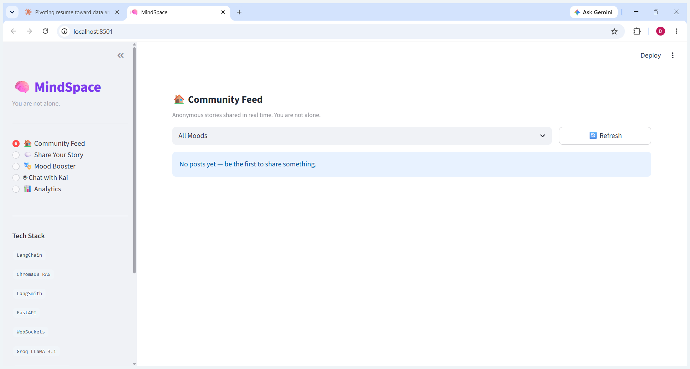
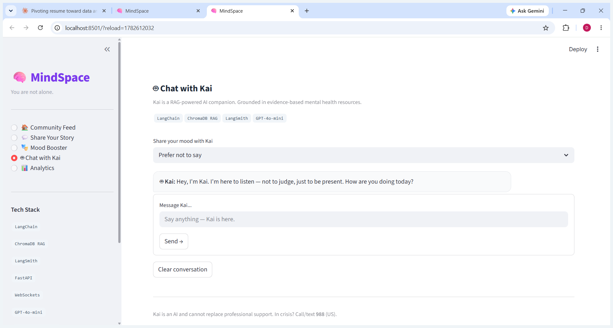
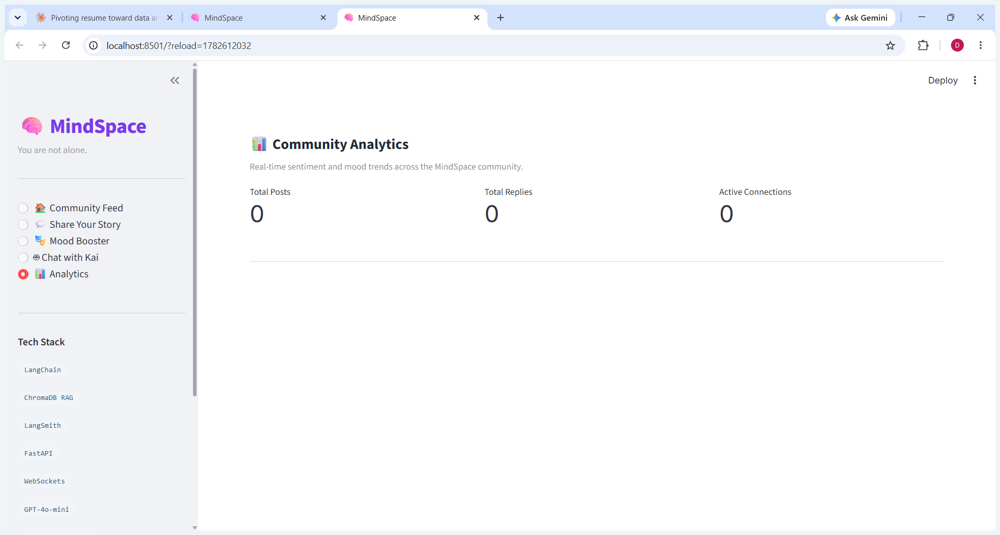

# MindSpace — Anonymous Mental Health Support Community


> A full-stack anonymous peer support platform with a **RAG-powered AI chatbot**, **LLM-based sentiment analysis**, **real-time WebSocket feed**, and **content moderation** — built with FastAPI, LangChain, ChromaDB, and Streamlit.

---

## Screenshots

### Community Feed — Real-time anonymous sharing with mood tags and upvotes


### Kai Chatbot — RAG-powered AI companion with evidence-based responses


### Analytics Dashboard — Live mood distribution and sentiment breakdown


> **Note:** Run the app locally and capture these screenshots to complete the README.

---

## Architecture

```
+------------------------------------------------------------------+
|                        Streamlit Frontend                         |
|  Community Feed - Share Story - Mood Booster - Kai - Analytics   |
+-----------------------------+------------------------------------+
                              | REST + WebSocket
+-----------------------------v------------------------------------+
|                       FastAPI Backend  v2.1                      |
|                                                                  |
|  +------------------+   +-------------------------------------+  |
|  |  Content Flow    |   |       Kai Chatbot (RAG)            |  |
|  |                  |   |                                     |  |
|  | POST /posts      |   |  LangChain + ChatGroq              |  |
|  |      |           |   |  (LLaMA 3.1 70B, free tier)       |  |
|  |      v           |   |       +                            |  |
|  |  Keyword         |   |  ChromaDB semantic search          |  |
|  |  Moderation      |   |  (14 evidence-based psych docs)    |  |
|  |      |           |   |       +                            |  |
|  |      v           |   |  LangSmith full chain tracing      |  |
|  |  Mood Sentiment  |   +-------------------------------------+  |
|  |  Analysis        |                                           |
|  |  (Groq LLaMA)    |   +-------------------------------------+  |
|  |      |           |   |  WebSocket Manager                 |  |
|  |      v           |   |  Real-time broadcast + ping        |  |
|  |  SQLite / PG     |   |  tracking + connection stats       |  |
|  |  (SQLAlchemy     |   +-------------------------------------+  |
|  |   async ORM)     |                                           |
|  +------------------+   +-------------------------------------+  |
|                         |     Anonymous JWT Auth              |  |
|                         |  No signup -- session token only    |  |
|                         +-------------------------------------+  |
+------------------------------------------------------------------+
```

---

## Tech Stack

| Layer | Technology | Purpose |
|-------|-----------|---------|
| LLM | **Groq LLaMA 3.1 70B** | Free-tier LLM for chatbot + sentiment analysis |
| Chatbot | **LangChain + ChatGroq** | Conversational chain with message history |
| RAG | **ChromaDB + sentence-transformers** | Semantic retrieval over 14 psych knowledge docs |
| Embeddings | **all-MiniLM-L6-v2** (local) | Free local embeddings - no API cost |
| Observability | **LangSmith** | Per-turn tracing: latency, tokens, RAG sources |
| Sentiment | **Groq async inference** | 10-category mood classification from post text |
| Moderation | **Keyword-based** | Pre-publish content screening (no API cost) |
| Backend | **FastAPI (async)** | REST API + WebSocket with input validation |
| Real-time | **WebSockets** | Live post/reply broadcast with connection metadata |
| Database | **SQLite / PostgreSQL + SQLAlchemy async** | Async ORM; SQLite for dev, Postgres for prod |
| Auth | **Anonymous JWT (python-jose)** | Persistent anonymous identity - no account needed |
| Frontend | **Streamlit + Plotly** | 5-page UI with community analytics charts |
| Infrastructure | **Docker + Compose** | PostgreSQL + backend + frontend containerized |

---

## Features

### Community Feed
- Share anonymously with 10 mood categories and a chosen alias
- **Real-time updates** via WebSocket - new posts and replies appear live, no refresh needed
- **AI mood detection** - Groq LLaMA 3.1 auto-classifies emotional state from post content
- **Content moderation** - every post screened before publishing
- Upvoting and threaded replies with anonymous names

### Kai - AI Mental Health Companion
- **RAG-powered** - retrieves from 14 evidence-based psychology documents before responding
- Knowledge base covers: CBT, DBT emotion regulation, grounding techniques, PTSD, grief, burnout, mindfulness, self-compassion, sleep, loneliness, and crisis resources
- **Trauma-informed**: does not push disclosure, bans toxic positivity, validates before suggesting
- **Crisis protocol** - surfaces 988 (US), 741741 (text), findahelpline.com (international) when needed
- LangSmith tracing for every conversation turn
- Mood-aware context injection - adapts tone based on stated emotional state

### Mood Booster
- 10 emotional categories x curated music, movies, and wellness activities
- 130+ personalized recommendations

### Analytics Dashboard
- Real-time mood distribution across the community
- AI-detected sentiment breakdown (Plotly charts)
- Mood trends over time (time-series line chart via /analytics/mood-trends)
- Active WebSocket connections and average session age

---

## Quick Start

```bash
git clone https://github.com/DharshanaReddy/mindspace
cd mindspace
cp .env.example .env
# Edit .env: add GROQ_API_KEY from https://console.groq.com (free)
```

**Option A - Docker (recommended, includes PostgreSQL):**
```bash
docker-compose up --build
# Frontend: http://localhost:8501
# Backend:  http://localhost:8001/docs
```

**Option B - Local with SQLite (zero config):**
```bash
pip install -r requirements.txt

# Terminal 1 - Backend
uvicorn backend.main:app --port 8001 --reload

# Terminal 2 - Frontend
cd frontend && python -m streamlit run app.py
```

---

## Environment Variables

| Variable | Required | Description |
|----------|----------|-------------|
| `GROQ_API_KEY` | Yes | Groq API key - free at console.groq.com |
| `GROQ_MODEL` | No | Defaults to `llama-3.1-70b-versatile` |
| `LANGCHAIN_API_KEY` | Recommended | LangSmith tracing - free at smith.langchain.com |
| `DATABASE_URL` | No | Defaults to SQLite; set PostgreSQL URL for production |
| `JWT_SECRET` | No | Secret for signing anonymous session JWTs |
| `BACKEND_URL` | No | Frontend to Backend URL (default http://localhost:8001) |

See `.env.example` for a fully commented template.

---

## API Reference

| Method | Endpoint | Description |
|--------|----------|-------------|
| `POST` | `/auth/session` | Issue anonymous JWT session token |
| `GET` | `/posts` | List posts (filter by mood, paginated) |
| `POST` | `/posts` | Create post (moderated + sentiment analyzed) |
| `POST` | `/posts/{id}/upvote` | Upvote a post |
| `POST` | `/posts/{id}/replies` | Reply to a post |
| `POST` | `/chat` | Message Kai (RAG chatbot, LangSmith-traced) |
| `POST` | `/analyze-mood` | Classify mood from arbitrary text |
| `POST` | `/suggestions` | Get music/movies/wellness for a mood |
| `GET` | `/analytics/overview` | Community mood + sentiment stats |
| `GET` | `/analytics/mood-trends` | Time-series mood counts (last N days) |
| `WS` | `/ws` | WebSocket for real-time post/reply feed |

Full interactive docs at `/docs` (Swagger UI auto-generated by FastAPI).

---

## LangSmith Observability

Every Kai conversation and RAG retrieval is traced in LangSmith:

- Per-turn latency and token usage
- Retrieved document IDs for RAG transparency
- Full chain visualization with input/output at each step

Set `LANGCHAIN_TRACING_V2=true` and add your `LANGCHAIN_API_KEY` to enable.
Free at smith.langchain.com.

---

## Project Structure

```
mindspace/
+-- backend/
|   +-- main.py              # FastAPI app, all routes
|   +-- config.py            # Pydantic-settings config
|   +-- auth/tokens.py       # Anonymous JWT generation
|   +-- database/
|   |   +-- connection.py    # Async SQLAlchemy engine
|   |   +-- models.py        # Post, Reply ORM models
|   |   +-- schemas.py       # Pydantic request/response models
|   +-- ml/sentiment.py      # Groq-based mood classification
|   +-- moderation/          # Keyword-based content screening
|   +-- rag/
|   |   +-- chatbot.py       # Kai chatbot (LangChain + ChromaDB)
|   |   +-- knowledge_base.py # 14 evidence-based psych documents
|   |   +-- vectorstore.py   # ChromaDB collection + retrieval
|   +-- suggestions.py       # 10 moods x curated recommendations
|   +-- websocket/manager.py # Real-time connection manager
+-- frontend/
|   +-- app.py               # 5-page Streamlit UI
+-- docker-compose.yml
+-- requirements.txt
+-- .env.example
+-- README.md
```
